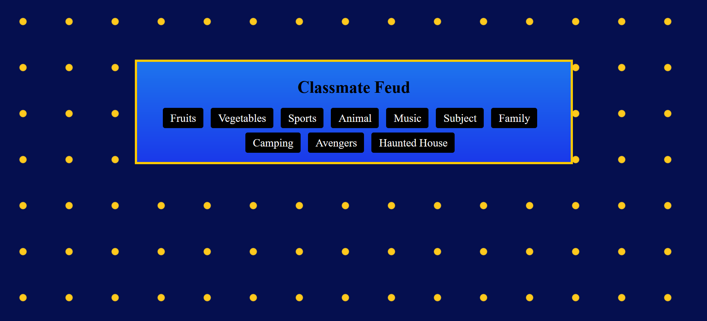
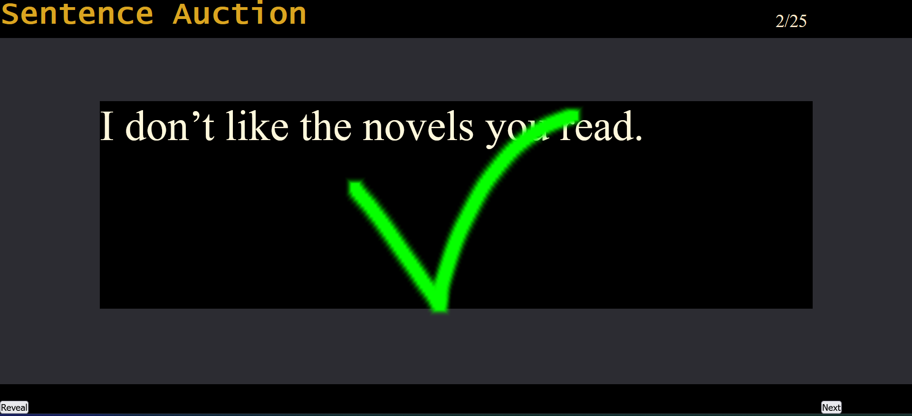
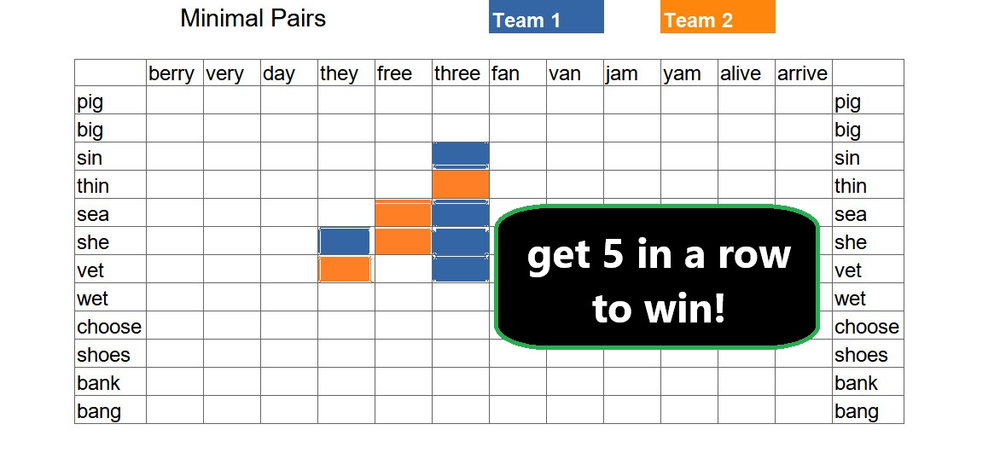
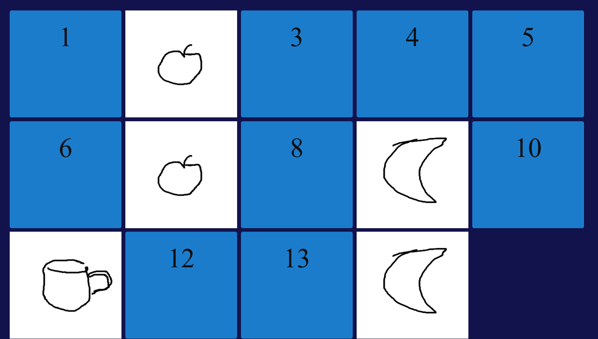

# About **Big Screen Games**

This repository is a collection of smart board games I've made while teaching English in China. Visit the README file in each game's directory to learn more about a particular game.

## 1. Jeopardy

## 2. Classmate Feud

## 3. Sentence Auction

## 4. Wu Zi Qi

## 5. Flipcard Memory Game
