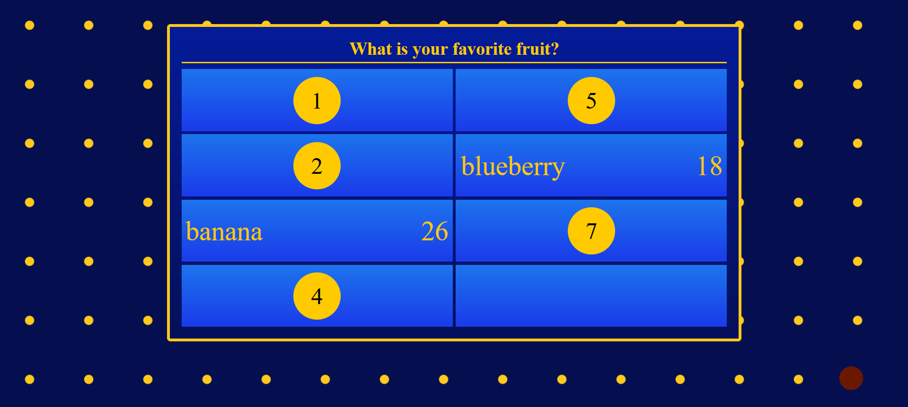

# 1. About **'Classmate Feud'**

<figure>
  
  <figcaption><i>A Classmate Feud game board.</i></figcaption>
</figure>

I created this game when I was an oral English teacher for high school students in China. It's based off the popular American TV game show "Family Feud." In family feud, two teams compete against each other to guess the answers given in public surveys. 

Unless you are very familiar with the game, I recommend you watch at least part of an episode before continuing.

This project comes pre-loaded with some 'categories.' However, you can also add and remove categories.

# 2. Requirements

  * A classroom computer connected to a large screen that all students can see.
  * An internet browser. (Note: I haven't tested different browsers, but I've never had any issues.)
  * A copy of the survey results that only you can see. (I use a hastily written piece of paper.)

# 3. Setup and Configuration

This section is optional. However the game is better if you add sound and if you customize it for your class.
  * to add sound, you'll need to know how to:
    - open files with text editors 
    - rename files
    - move files into different directories (aka folders)
  * to customize the game, you might need basic knowledge of javascript.

## I. Adding Sound

You should provide your own audio files for game sound effects. There are three types of sound you'll need:
  * a click sound
  * a positive sound (to indicate a correct answer)
  * a negative sound (to indicate an incorrect answer)

  Follow the steps below to add sound to your game.

1. Get audio files
    - If you don't have such audio files, you can browse through opengameart.org and download some for free. 
1. Move your audio files to the `/classmate-feud/audio/` directory
1. Rename the files
    - Open `/classmate-feud/setup.js` with a text editor and look at line 11. 
    - You should see something like this:
        ```
        let clickSound = new Audio('./audio/click.wav');
        let positiveSound = new Audio('./audio/positive-sound.wav');
        let wrongSound = new Audio('./audio/buzz-sound.wav');
        ```
    - You can either:
      * rename your audio files to match the file names in setup.js 
      * OR rename the file names in the setup.js file, e.g. 
        - if `downloaded-click.mp3` is the audio file name, edit the code.
           ```
           let clickSound = new Audio('./audio/downloaded-click.mp3');
           ```

## II. Customizing Categories

This project comes pre-loaded with some 'categories.' Ideally, you should deliver a lesson or two beforehand in which students conduct their own surveys and give you their own data. Then you can process that data and make your own categories.

### a. How to Remove a Category

Open 'setupGames.js' with a text editor, scroll to the bottom of the document and locate the variable 'games'.

In the variable 'games', remove the name of the game that you don't want. 
For example, if I didn't want the "What is your favorite fruit?" game, I'd remove "fruitGame".

### b. How to Add a Category

1. Open 'data.js' with a text editor and add data in the following format:

    ```
    var newCategoryData = [
        'Category Display Name',
        'Question / Prompt',
        ` // <- backtick
        card-position; text on card; points
        ...
        `
    ];
    ```

    ***Note: The 3rd item in the *newCategoryData* array is wrapped with backticks (\`), NOT quotes (\'). The backtick (\`) key shares a place on your keyboard with the tilde key (~).***

    See below for an example of how to add the data from the "Name some signs that your house is haunted" survey.

    ```
    var hauntedHouseData = [
        'Haunted House', 
        'Name some signs that your house is haunted.', 
        `
        1; noises/ voices; 80 
        2; moving objects; 36
        3; flickering lights; 24
        4; doors open/close; 14
        5; ghosts; 12
        6; weird smells; 6
        `
    ];
    ```

2. Open setupGames.js with a text editor, locate the rows of games towards the bottom of the document, and make a *Game* object from the data.

    ```
    var fruitGame = new Game(fruitData);
    ...
    var avengersGame = new Game(avengersData);
    var myNewGame = new Game(myNewData)
    ```

    For our haunted house example, this would look like this:

    ```
    var fruitGame = new Game(fruitData);
    ...
    var avengersGame = new Game(avengersData);
    var hauntedHouseGame = new Game(hauntedHouseData);
    ```

3. Open setupGames.js with a text editor, scroll to the bottom, and add your new game object to the *games* array.

    ```
    var games = [fruitGame, ..., avengersGame, myNewGame];
    ```

    For our haunted house example, this would look like this:

    ```
    var games = [fruitGame, ..., avengersGame, hauntedHouseGame];
    ```

Your category is now ready to use!

# 4. How to Play

You can play however you want. This is how I play.

## I. Launch the Game

Double-click on 'classmate-feud.html' to open the game.

## II. Set up the classroom
* Divide the classroom into two teams.
* Have each team volunteer 5 of their members to represent them as a *squad*
* Have two members of opposing squads play Rock, Paper, Scissors to see who will go first (and choose the category).

## III. Play through a round
* The first member of a squad guesses an answer.
    - If they get it right:
      - reveal the card
      - add the points to a ledger
      - let them go again
    - If they get it wrong:
      - press the red circle on the bottom right-hand corner of the screen to make a buzz sound.
      - move onto the next student in the squad
* Continue until all questions have been answered OR until all members of a squad have guess incorrectly.
    * If all questions have been answered correctly:
        - award all points team with the winning squad
        - proceed to the next round and let the losing team go first.
    * If all members have answered incorrectly, present the other team with a choice:
        - Don't attempt to 'steal' -> both teams get nothing
        - Attempt to 'steal' -> (the other team's squad attempts to answer the remaining questions)
            fail -> first team keeps it points, second team keeps what it got
            success -> the stealing squad gets all of the points

Play 2-3 rounds. Refresh the page to reset.

## IV. Play a rapid-fire round
At the end, you can play a rapid-fire round.
Have the whole class participate by bringing up a new category and alternating between teams for guesses.
