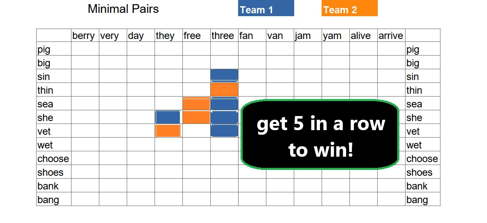

# About Minimal Pair Wu Zi Qi

I learned about Wu Zi Qi while teaching English in China. In this game, two players take turns placing physical pieces on a grid. The first player to place 5 pieces in-a-row wins the game. The straight line can go horizontally, vertically, or diagonally.

This is a modified version of that game. The rules are the same. Place 5 pieces in a row to win. However, instead of players placing pieces on a physical game board, the players (students) have to tell the teacher where to place their pieces by calling out the coordinates of the desired location.

However, the catch is that the coordinate names are full of minimal pairs. Minimal pairs are pairs of words that have a minimal difference in sound. For example, the pair (sin, thin) demonstrates the difference between the 's' and 'th' sounds. ESOL(English as a Second Or foreign Language) learners have a lot to gain by spending some time with minimal pairs.

## Why This Game Is Here

Even though this modified-version of Wu Zi Qi doesn't have any code, I decided to include it in this repo. I did so because it's a good game and I'm quite proud of having designed it. Here are some of its properties:
* It is simple.
* It is scalable in size (it can be played with large classes or just two people).
* It is flexible in difficulty (the teacher can decide how strict or lenient he/she will be when determining what the student said).
* It is engaging (even people who don't actively participate in the game will be thinking about the differences in sound between words).

## How to Play

1. Explain the rules to the players.
1. Open `minimal-pair-wu-zi-qi.jpg` with MS paint.
1. Select the paint bucket tool.
1. Alternate between the teams' colors as the game progresses.
1. The first team to place 5 pieces in a row wins!

*Note: Don't save the file at the end of the game.*
