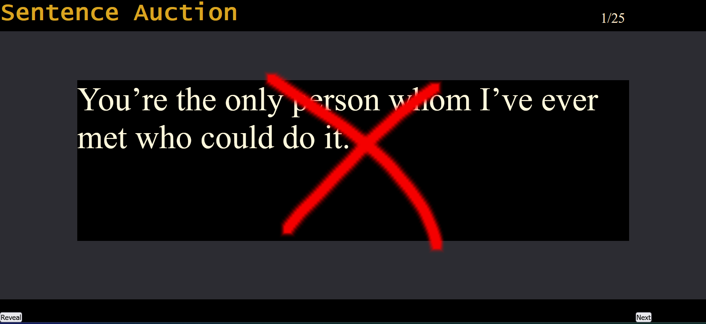

# 1. About **'Sentence Auction'**

<figure>
  
  <figcaption><i>The revelation of a grammatically incorrect sentence.</i></figcaption>
</figure>

I created this game when I was an oral English teacher for high school students in China. 

Sentence Auction:
  * **Teacher's Role:** Auctioneer
  * **Number of Teams:** 4-5
  * **Win Condition:** Collect the most sentences by the end of the game.
  * **Game Mechanics:** Teams bid against each other to collect sentences
    - ***BEWARE:*** some sentences have grammar, spelling, or punctuation errors. These sentences are ***worthless*** and don't count as collected sentences.

The original idea for this game came from some blog or teaching website that I can't remember. I can't remember if it called for using PPTs, chalk & board, or some other medium, but regardless I decided to make a browser-based + spreadsheet version of it for the following advantages:
  1. Easy editing and management of sentences.
      - manage sentences in the `sentences.ods` spreadsheet
      - copy from this spreadsheet into the `sourceText` variable in `setup.js` (see `setup.js` for more information)
      - this is much easier than using a text document or a PPT to track and edit sentences
  1. Avoidance of software compatibility and configuration issues
      - using simple JavaScript ensures that any computer with a browser can run this game
      - I've had too many issues with PPTs working differently on a classroom computer vs my personal computer
  1. Sound Effects
      - the students really like the sound effects I've implemented. The buzz sound for incorrect answers, clock tick, the 'ding-ding' sound for correct answers
  1. Randomization
      - going through the *same exact* questions in the same order for multiple classes can get *very* boring for the teacher
      - the teacher will never know what sentence is coming up or if it's the right/wrong version of the sentence
  1. Seamless Experience
      - The game flows very well. There is no annoying downtime (e.g. waiting for the teacher to write faster)

# 2. Requirements

  * A classroom computer connected to a large screen that all students can see.
  * An internet browser. (Note: I haven't tested different browsers, but I've never had any issues.)

# 3. Setup and Configuration

This section is optional. However the game is better if you add sound and customize the content for your class.
  * to add sound, you'll need to know how to:
    - open files with text editors 
    - rename files
    - move files into different directories (aka folders)
  * to customize the game, you'll need basic knowledge of javascript.

## I. Adding Sound

Open `script.js` and locate the following code near the top:
```
let game_over_man = new Audio('../audio/game-over-man.wav');
let ding1 = new Audio('../audio/ding-ding.mp3');
let ding2 = new Audio('../audio/ding-ding.mp3');
let buzz1 = new Audio('../audio/wrong-1.wav');
let buzz2 = new Audio('../audio/wrong-2.wav');
let tick1 = new Audio('../audio/tick-1.wav');
let tick2 = new Audio('../audio/tick-2.wav');
let tick3 = new Audio('../audio/tick-3.wav');
let tick4 = new Audio('../audio/tick-4.wav');
let tick5 = new Audio('../audio/tick-5.wav');
let ticks = [tick1, tick2, tick3, tick4, tick5];
let cardflip = new Audio('../audio/flip-card.wav');
```

The file paths indicated above correspond to the audio files you'll need to get yourself. They are NOT INCLUDED in this repo. 

You might notice that there are many variations of the same sounds. This is to add auditory variety. Listening to the same sounds can get very boring.

To add sound to the game:
1. Get audio files
    - If you don't have such audio files, you can browse through opengameart.org and download some for free. 
1. Move the audio files to the `/sentence-auction/audio/` directory.
1. Rename the files
    - Open `/sentence-auction/scripts.js` with a text editor.
    - In `scripts.js` you should see lines like this:
        ```
        let powerup = new Audio('./audio/daily-double.wav');
        ```
    - Each 'Audio' object corresponds to a sound.
    - You can either:
      * rename your audio files to match the file names in scripts.js 
      * OR rename the file names in the scripts.js file, e.g. 
        - if `downloaded-click.mp3` is the audio file name, edit the code.
           ```
           let clickSound = new Audio('./audio/downloaded-click.mp3');
           ```

## II. Customize the Game

This project comes pre-loaded with some sentences but you can add your own to focus on whatever topic you want to cover.

See `setup.js` for more info.

# 4. How to Play

The teacher is the auctioneer. Bring a lot of energy. Speak fast.

* Explain the rules of the game as indicated in **1. About 'Sentence Auction'**.
* Give each team $2500 (imaginary). 
* Keep a ledger of spent money on the board next to the screen.
* Keep a ledger of collected sentences on the board next to the screen.
* Open `index.html`.
* In the beginning, start the bidding at $100.
  - if students are hesitant to buy sentences, I like to go as low as $1.
  - later on, you can start the bidding at higher dollar amounts.

Play until there are no more questions left. The team with the most sentences at the end wins.